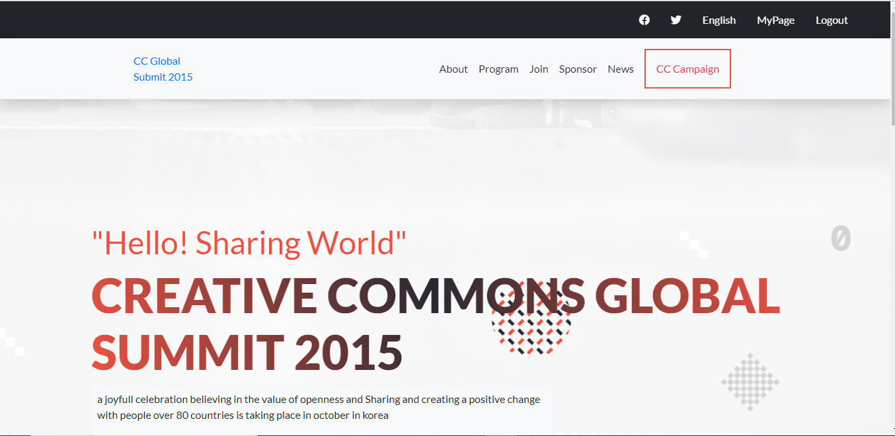

# Project Name
deploying my capstone project

> this project is a project on my porfolio

## Live Demo

[Live Demo Link](https://victor-chukwu.github.io/capstone-one/)

## Built With
- html, scss
- node, git, bootstrap

To get a local copy up and running follow these simple example steps.

### Prerequisites
install git, node, any code editor in your local machine

### Setup
clone the repo or download from https://github.com/VICTOR-CHUKWU/capstone-one

### Install
install all dependencies with npm install

### Usage
open index.html in your local browser

## Authors
👤 **Victor**

- GitHub: [@VICTOR-CHUKWU](https://github.com/VICTOR-CHUKWU)
- LinkedIn: [Victor-chukwu](https://www.linkedin.com/in/victor-chukwu-95a020143)

## 🤝 Contributing
Contributions, issues, and feature requests are welcome!

## Show your support

Give a ⭐️ if you like this project!

## Acknowledgments

- thanks to my microvers team mates
- thanks to Cindy Shin the author of orinal design
- Microverse

